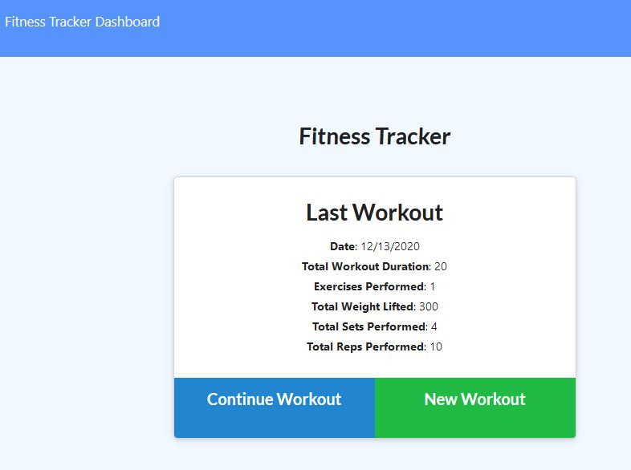
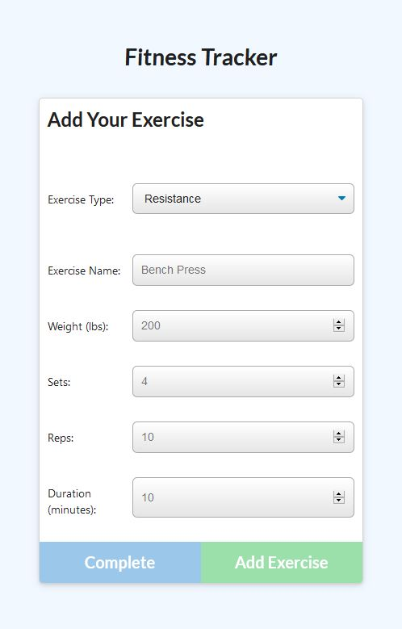
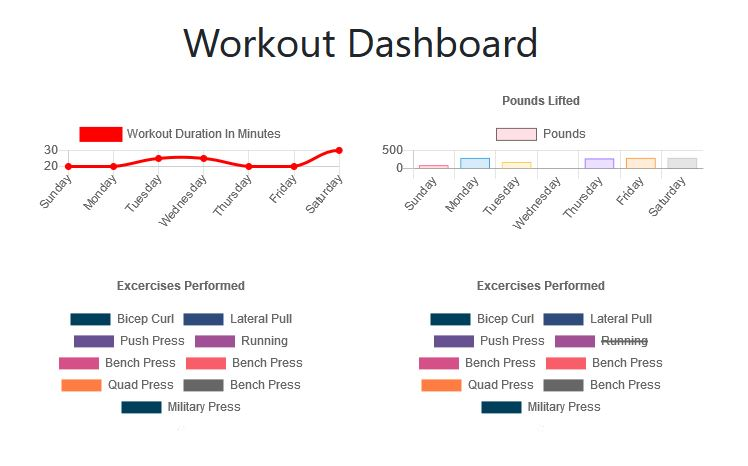

# Note Taker

<br />

## Description

This fitness tracking app allows users to add, and keep record of their daily exercise. Very useful for people on the go!

## Contents

- [Installation](#installation)
- [User Story](#user-story)
- [Usage](#usage)
- [Demonstration](#demonstration)
- [Screenshots](#screenshots)
- [Questions](<#questions-(FAQ)>)
- [Contact](#contact)
- [Author](#authors)
- [Acknowledgements](#acknowledgements)

## Installation

#### Requirements:

1. MongoDB
2. Nodejs

#### To install Workout Tracker app:

1. Clone the repo to your local machine.
2. Open a terminal window and navigate to the local directory.
3. Run

```
npm install
```

4. Create a new mongodb database.
5. Create a .env file in the root directory of the application. Add <addr>MONGODB_URI=mongoapplication<addr>, replacing "mongoapplication" with the connection string to your database.
6. Run

```
npm run seed
```

to apply seed data.

## User Story

```
As a user, I want to be able to view create and track daily workouts. I want to be able to log multiple exercises in a workout on a given day. I should also be able to track the name, type, weight, sets, reps, and duration of exercise. If the exercise is a cardio exercise, I should be able to track my distance traveled.
```

## Usage

1. Open a terminal and navigate to the applications cloned directory.

2. Run `node server.js` in the directory.

3. Open a web browser and navigate to https://localhost:7000.

4. Use the workout tracker app!

## Demonstration

- [Deployed Application](https://fitness-tracking-simple.herokuapp.com)

## Tests

- No included tests for this application.

## Screenshots

_Landing page/summary page to get started_



_Selecting a workout_



_Aggregate statistics of workouts page_



## Questions

- Submit questions to my contact details below.
- App is hosted on Heroku.

## Contact

- Contact me with any questions on my email: agre.fun21@gmail.com or silver.grech@gmail.com

## Author

- Initial front end files to develop by Trilogy Education Services
- Andr&eacute; Grech - 15/12/2020

### Acknowledgements

- © 2019 Trilogy Education Services, a 2U, Inc. brand. All Rights Reserved.
